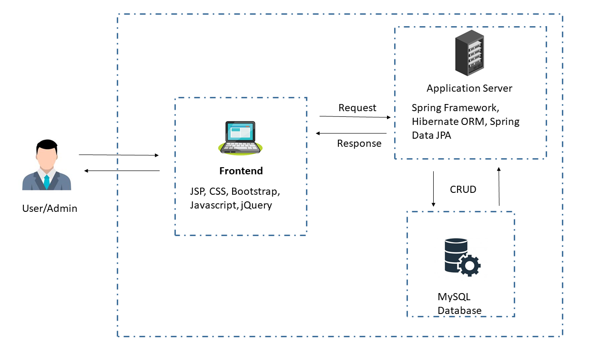

# Bus Management System

## Introduction

The Bus Management System is a web-based application that may be used by anyone with an internet connection anywhere on the internet. This application will automate the booking of tickets as well as inquiries about ticket availability. The system will keep track of numerous routes and the buses that run along with them. The system will be built as a web-based application with the main user interface. The primary screen should have a consistent and adaptable format. The system must be built to be user-friendly. Revenue reports can be generated by the admin, which will be useful in determining whether any operational changes are required.

## Requirement

Buses have been a widely used means of transportation since their inception. The current system isn't fully automated. Many procedures, such as bus scheduling and ticket booking, are performed manually, which results in inaccurate entries and leaves room for errors since the data is out of sync. Seat availability is not centrally managed, and the travel operator is unaware of the availability and occupancy of his buses' seats. The main bottleneck is here. As a result, in this modern era, where people prefer to purchase tickets online, a management system that allows passengers to book tickets for long bus travels without bother becomes important. 
Therefore, a managed system is required which can overcome the difficulties and faults in the old queue management system.

## Technology Stack

- **Frontend Development** : JSP, CSS, Bootstrap, Javascript, jQuery.
- **Middle tier business logic** : Spring Framework, Hibernate ORM, Spring Data JPA.
- **Backend database** : MySQL database.
- **Reporting(Excel)** : Apache POI.

## Architecture

 The bus management system is made up of information about buses and routes, as well as their management. It also provides passenger-related data and its management, which includes the ability to create, amend, and delete records. A three-layer system is used. HTML, CSS, and JS have been used to implement the front-end layer. The middle layer is built with Java 8/Spring Framework, while the database layer is built with MySQL.

 

## Use Cases

Below are the Use cases of the Bus management system:

1. Passengers can register/login into the system.
2. Passengers can see all bus information between two stops.
3. Passengers can book a bus ticket with a maximum of 6 seats.
4. Passengers can cancel a ticket(No Partial Cancellation).
5. On Booking a ticket, a unique 10 digit PNR will be generated.
6. On Succesful Booking,e-Ticket is being sent to registered Email Address.
7. Admin can add a new bus.
8. Admin can enable/disable a bus.
9. Admin can generate Revenue report for the last 30 days.
10. Admin can generate Bus Seat Utilisation Report for the last 30 days.
11. Admin can generate PNR Report of a bus for the next day.

## Future Scope

- Forgot password / change password feature.
- Payment Gateway integration.
- Selection of particular seat position.
- Addition of routes.
- Edit bus information.

